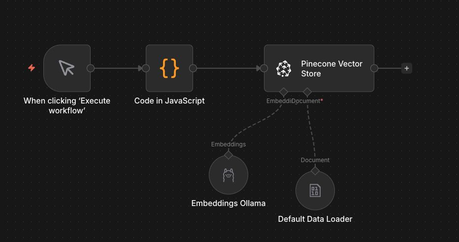

# AI Sales Agent with RAG (Retrieval-Augmented Generation)


A fully automated AI agent designed to handle inbound business inquiries via Telegram. This system utilizes **RAG (Retrieval-Augmented Generation)** to fetch real-time company portfolio data from a vector database and generate hyper-personalized business proposals.

---

## 💡 Background & Problem Statement

### 1. The Resource Gap
**As a founder of a software agency**, I face a critical challenge: managing inbound leads while focusing on product delivery. I currently do not have the resources to hire a dedicated, full-time sales representative. However, leaving potential client inquiries unanswered or responding late is not an option. I needed a system that could act as a "first-line" responder—professional, knowledgeable, and available 24/7—without the overhead of additional headcount.

### 2. The Exploration Drive
Beyond the operational need, this project serves as a technical exploration into **Agentic Workflows**. I wanted to test the limits of what a low-code orchestration tool (n8n) combined with a Vector Database (Pinecone) could achieve. Specifically, I wanted to see if an AI agent could move beyond generic "chatbot" responses and actually understand complex agency portfolios to draft meaningful business proposals.

---

## 📸 Screenshots

### 1. The Brain (Telegram Bot Agent)
The main workflow that handles chat memory, intent recognition, and RAG retrieval.


### 2. The Knowledge Loader
The pipeline responsible for ingesting company data/documents into Pinecone Vector Store.


---

## ✨ Key Features

* **Context-Aware Responses:** Uses `Window Buffer Memory` to maintain conversation context with the user, ensuring the bot remembers previous details in the chat.
* **RAG Architecture:** Fetches specific portfolio case studies (e.g., ERP Systems, Landing Pages) from Pinecone to ground the AI's responses in fact, preventing generic answers.
* **Dual-Workflow System:** Separates the "Learning" phase (Data Ingestion) from the "Acting" phase (Chat Bot) for better modularity.
* **Platform Agnostic:** While currently built for Telegram, the core logic can be easily adapted for WhatsApp, Slack, or Email triggers.

## 🛠️ Tech Stack

* **Orchestration:** [n8n](https://n8n.io/) (Self-hosted)
* **LLM:** OpenAI GPT-4o Mini (Interchangeable with Local LLMs via Ollama)
* **Vector Database:** Pinecone
* **Interface:** Telegram Bot API
* **Tunneling:** Ngrok (for local development)

## 🚀 How to Run

1.  **Clone the repository**
    ```bash
    git clone [https://github.com/reginaldooo/n8n-rag-sales-agent.git](https://github.com/username/ai-sales-agent-rag.git)
    ```

2.  **Import Workflows**
    * Open your n8n dashboard.
    * Import `workflows/01-knowledge-ingestion.json` (Run this once to load your data).
    * Import `workflows/02-sales-agent-bot.json` (Activate this to start the bot).

3.  **Setup Credentials**
    * Create a `.env` file based on `.env.example`.
    * Configure your Telegram Bot Token and OpenAI API Key in n8n credentials manager.

4.  **Start the Agent**
    * Ensure your webhook tunnel is active.
    * Set the workflow to `Active`.
    * Chat with your bot on Telegram!

---

## 🚧 Project Status: Exploration & Validation

**Disclaimer:** This project is currently in the **Proof of Concept (PoC)** phase. It serves as an exploration into Agentic AI workflows and is not yet a fully polished enterprise-grade product.

However, even in this experimental state, the system has **successfully validated** a key hypothesis:
> *RAG-based Agents are significantly more effective at sales than traditional chatbots. They don't just answer; they "understand" context and sell based on actual company portfolios.*

The potential impact of refining this system for full production is massive for small agencies looking to scale without increasing headcount.

---

## 🔮 Future Improvements (Ideas for Contribution)

If you are interested in forking or contributing to this project, here are some high-impact features that would take this agent to the next level:

### 1. 📞 Human Handoff Protocol
Currently, the bot handles everything. A critical improvement would be adding a "Handoff Logic"—if the sentiment analysis detects frustration or a high-value lead, the bot should pause and alert a human admin via Telegram to take over.

### 2. 📊 CRM Integration
Instead of just chatting, the agent could extract structured data (Client Name, Budget, Project Type) and save it directly into a CRM (like HubSpot, Notion, or Google Sheets) using n8n's structured output parsers.

### 3. 📱 Multi-Channel Support
The logic is solid, but Telegram is niche in some markets. Porting this workflow to **WhatsApp Business API** or **Slack** would make it instantly viable for a wider range of businesses.

### 4. 🧠 Persistent Memory via Database
Currently, we use `Window Buffer Memory` (RAM-based). upgrading to a persistent database (like Redis or PostgreSQL) would allow the bot to remember a user who chatted weeks ago ("Hi Regin, how was your project launch last month?").

---

## 📄 License

This project is open-source and available under the [MIT License](LICENSE).